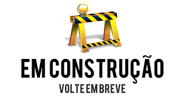

---
output:
  html_document:                    # Classe de documento.
    toc: true                       # Exibir sum?rio.
    toc_depth: 2                    # Profundidade do sum?rio.
    toc_float:                      # Sum?rio flutuante na borda.
      collapsed: true
      smooth_scroll: true
    number_sections: true           # Se??es numeradas.
    theme: flatly
    #spacelab
    #default,cerulean,journal,flatly,readable,spacelab,
    #united,cosmo,lumen,paper,sandstone,simplex,yeti
    
    highlight: espresso
    #default, tango, pygments, kate, monochrome, espresso, zenburn, haddock, and textmate
    #css: styles.css                 # Caminho para arquivo CSS.
    fig_width: 7                    # Lagura das figuras.
    fig_height: 6                   # Altura das figuras.
    fig_caption: true               # Exibica??o de legenda.
    fig_align: 'center'
#    code_folding: hide              # Esconder/exibir bloco de c?digo.
#    keep_md: true                   # Manter o arquivo md.
    #template: quarterly_report.html # Caminho para o template.  
---

```{r setup, include=FALSE}
knitr::opts_chunk$set(echo = TRUE, cache = TRUE)
```

---

<center>
<td>  </td>
</center>

---

<div class="tocify-extend-page" data-unique="tocify-extend-page" style="height: 0;"></div>

