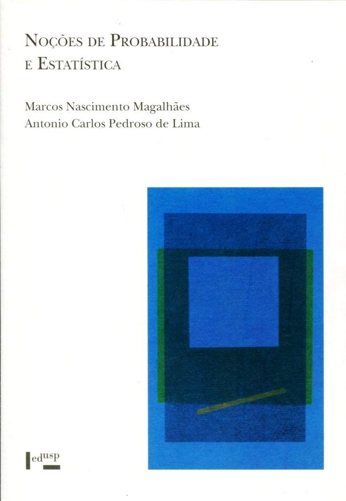

---

---

 

 <b> Noções de Probabilidade e Estatística </b> 

 

 [Lineu Alberto Cavazani de Freitas](https://lineu96.github.io/st/) 

 

---

# **Apresentação**

---

Uma versão preliminar deste material surgiu na minha época de graduação em Estatística na UFPR quando fui indicado por colegas para dar aulas particulares de Estatística Básica para alunos de outros cursos. Na versão inicial era uma material bem amplo e genérico que, após conseguir tempo, fiz questão de melhorá-lo.

Todo o texto foi extremamente baseado no livro [Noções de Probabilidade e Estatística](https://www.ime.usp.br/~noproest/doku.php), dos autores [Marcos Nascimento Magalhães](https://www.ime.usp.br/~marcos/) e [Antonio Carlos Pedroso de Lima](https://www.ime.usp.br/~acarlos/doku.php). Muitos trechos foram, inclusive, copiados na íntegra dada a clareza como o conceito foi exposto no livro. 

---

---

Apesar de ser um livro altamente didático, para a produção deste material eu fiz algumas alterações na ordenação de como alguns tópicos foram apresentados e alguns assuntos sequer são mencionados. 

O material está dividido em 9 partes:

 - **Parte 1**: Conceitos Iniciais.
 - **Parte 2.1**: Introdução à análise exploratória de dados: tabelas de frequência.
 - **Parte 2.2**: Introdução à análise exploratória de dados: medidas resumo e análise gráfica.
 - **Parte 3**: Probabilidades.
 - **Parte 4**: Variáveis aleatórias discretas.
 - **Parte 5**: Variáveis aleatórias contínuas.
 - **Parte 6.1**: Inferência: conceitos iniciais e estimadores pontuais.
 - **Parte 6.2**: Inferência: estimação por intervalo e testes de hipótese.
 - **Parte 7**: Tópicos interessantes não abordados.
 
---

Uma ênfase maior foi dada da Parte 1 até a Parte 2.2. Se tratam de conceitos básicos e técnicas simples porém suficientes para extração de informações importantes quando a tarefa é analisar um conjunto de dados.

Por ser um material voltado para aprendizado de Estatística, indicado para aqueles que estão dando seus primeiros passos nesta área, não foram apresentados muitos aspectos teóricos. E, para sintetizar o texto, poucos exemplos foram apresentados. 

---

Lembre-se, o que está aqui nem de perto é tudo o que a Estatística tem a oferecer. Existe uma infinidade de técnicas e métodos para os mais diversos fins.

---

Críticas e sugestões a este material sempre serão bem vindas.

Para entrar em contato comigo, envie uma mensagem para <lineuacf@gmail.com>.

---

