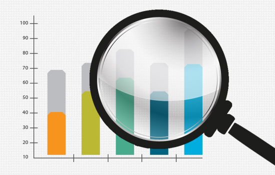
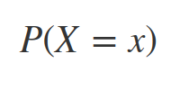
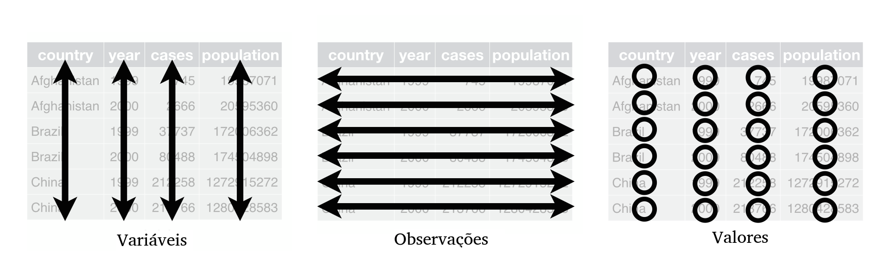

---
output:
  html_document:                    # Classe de documento.
    toc: true                       # Exibir sum?rio.
    toc_depth: 2                    # Profundidade do sum?rio.
    toc_float:                      # Sum?rio flutuante na borda.
      collapsed: true
      smooth_scroll: true
    number_sections: true           # Se??es numeradas.
    theme: flatly
    #spacelab
    #default,cerulean,journal,flatly,readable,spacelab,
    #united,cosmo,lumen,paper,sandstone,simplex,yeti
    
    highlight: espresso
    #default, tango, pygments, kate, monochrome, espresso, zenburn, haddock, and textmate
    #css: styles.css                 # Caminho para arquivo CSS.
    fig_width: 7                    # Lagura das figuras.
    fig_height: 6                   # Altura das figuras.
    fig_caption: true               # Exibica??o de legenda.
    fig_align: 'center'
#    code_folding: hide              # Esconder/exibir bloco de c?digo.
#    keep_md: true                   # Manter o arquivo md.
    #template: quarterly_report.html # Caminho para o template.  
---

```{r setup, include=FALSE}
knitr::opts_chunk$set(echo = TRUE, cache = TRUE)
```

---

<font size="5"> 
<p align=”center”> <b> Parte 1 - Conceitos iniciais </b> </center>
</font>

---

# **O que é Estatística**

Entende-se por Estatística o conjunto de métodos e técnicas usados para organizar, descrever, analisar e interpretar um ou mais conjuntos de valores (dados) oriundos de estudos e experimentos das mais diversas áreas do conhecimento. Compreende:

 - **Planejamento** de coleta de dados (via experimentos ou observação).
 - **Descrição** e **Análise** dos dados para extração de informações.
 - **Interpretação** dos resultados a fim de avaliar se estas informações comprovam ou refutam as hipóteses de interesse.

---

# **Ramos da Estatística** {.tabset .tabset-fade}
Os maiores ramos da Estatística são: **Estatística descritiva** ou **exploratória**, **Probabilidade** e **Inferência**.

---

## **Estatística descritiva ou exploratória**

Conjunto de técnicas destinadas a descrever e resumir dados a fim de tirar conclusões a respeito de características de interesse. 

Compreende a etapa de consistência dos dados, isto é, verificar se os dados coletados são condizentes com a realidade. 

Nesta etapa busca-se gerar resumos numéricos, medidas descritivas e visualizações gráficas acerca dos dados com o intuito de compreender preliminarmente o comportamento das variáveis individualmente e as interações entre elas.

<center>

</center>

---

## **Probabilidade**

A palavra probabilidade deriva da palavra em Latim *probare*. A teoria das probabilidades tenta quantificar a noção de provável, ou seja, de que forma podemos lidar e quantificar incertezas. 

É a teoria matemática utilizada para se estudar a incerteza oriunda de fenômenos de caráter aleatório.

<center>

</center>

---

## **Inferência**

A inferência estatística é o ramo responsável pela estimação de quantidades desconhecidas da população (os chamados parâmetros) com base numa amostra.

Nesta área formulam-se e testam hipóteses com o objetico de extrapolar para a população resultados obtidos na amostra. 

Vale ressaltar que se tivermos informação sobre todos os elementos da população não se faz necessário o uso das técnicas de inferência.

<center>

</center>

---

# **População e Amostra**

Em Estatística dois conceitos são importatntíssimos: população e amostra.

 - **População**: conjunto de seres, itens ou eventos com uma característica comum. TODOS aqueles que possuem a característica de interesse pertencem à população.
 
 - **Amostra**: subconjunto da população. Na prática é inviável trabalhar com a população toda, a alternativa então é trabalhar com uma amostra e inferir os resultados para a população. A seleção da amostra pode ser feita de diversas maneiras. A forma mais comum é a chamada amostragem aleatória simples, em que todos os elementos da população possuem a mesma probabilidade de serem selecionados para a amostra. Existem outras formas de amostragem, tais como: amostragem aleatória estratificada, por agrupamento, sistemática, etc. A forma adequada de amostragem conduz a um menor tamanho amostral para obtenção de uma precisão satisfatória.

<center>

</center>

---

# **Etapas do processo de análise**

De forma geral, as etapas para análise de um conjunto de dados são:

 - **Definição** do problema.
 - **Planejamento** do estudo.
 - **Coleta** de dados.
 - **Análise** dos dados (análise exploratória e aplicação de métodos mais sofisticados que permitam generalizar os resultados para a população).
 - **Interpretação** dos resultados.
 
---

# **Tabela de dados**

Denominam-se **Variáveis** as características observadas em cada um dos elementos que pertencem à amostra. Na prática precisamos de uma forma para representar indivíduos e variáveis.

Um conjunto de dados considerado arrumado é aquele em que cada coluna representa uma variável, cada linha representa uma observação e cada célula representa o valor observado no elemento $i$ na variável $j$:

<center>

</center>

O conjunto de dados completo e sem tratamentos é denominado **conjunto de dados brutos** e, na prática, podemos coletar variáveis de diferentes tipos e naturezas.

---

Como exemplo de conjunto de dados brutos considere que um questionário foi aplicado aos alunos do primeiro ano de uma escola (disponível [aqui](https://www.ime.usp.br/~noproest/dados/questionario.txt)) e possui as seguintes informações:

 - **Id**: identificação do aluno.
 - **Turma**: turma a que o aluno foi alocado (A ou B).
 - **Sexo**: F se feminino, M se masculino.
 - **Idade**: idade em anos.
 - **Alt**: altura em metros.
 - **Peso**: peso em quilogramas.
 - **Filhos**: número de filhos na família.
 - **Fuma**: hábito de fumar, sim ou não.
 - **Toler**: tolerância ao cigarro: (I) indiferente; (P) incomoda pouco; (M) incomoda muito.
 - **Exerc**: horas de atividade física, por semana.
 - **Cine**: número de vezes que vai ao cinema por semana.
 - **OpCine**: opinião a respeito das salas de cinema na cidade: (B) regular a boa; (M) muito boa.
 - **TV**: horas gastas assistindo TV, por semana.
 - **OpTV**: opinião a respeito da qualidade da programação na TV: (R) ruim; (M) média; (B) boa; (N) não sabe.

---

Parte dos dados brutos, representados em forma de tabela têm a seguinte forma:

<div align="center">

**Informações de questionário estudantil - dados brutos.**

```{r, echo=FALSE}
dados <- read.table("https://www.ime.usp.br/~noproest/dados/questionario.txt", header = T)

DT::datatable(dados[, c(5, 1:4)], rownames = FALSE, width = 600)

```
</div>

---

## **Tipos de variável**

Existem dois tipos de variáveis: as numéricas (**quantitativas**) e as não numéricas (**qualitativas**), cada uma das classes tem suas ramificações:

**Variáveis Quantitativas**: assumem valores numéricos. 

Podem ser:

 - **Discretas**: características mensuráveis que podem assumir apenas um número finito ou infinito contável de valores e, assim, somente fazem sentido valores inteiros.
 
 - **Contínuas**: características mensuráveis que assumem valores em uma escala contínua, isto é, na reta real.

**Variáveis Qualitativas**: são as características definidas categorias, ou seja, representam uma classificação dos indivíduos e não uma característica numérica. 

Podem ser:

 - **Nominais**: não existe ordenação nem peso entre as categorias.

 - **Ordinais**: existe uma ordenação entre as categorias.

<center>

</center>

---

Existem peculiaridades na classificação de variáveis devido a situações como: discretização de variáveis contínuas, limitações em instrumentos de mensuração, utilização de quantidades numéricas para representação de variáveis categóricas, etc. Deve-se sempre estar atento a este tipo de situação pois podem levar a implicações nas análises e consequentemente nos resultados.

---

Classificando as variáveis do conjunto de dados do exemplo:

 - **Id**: variável qualitativa nominal.
 - **Turma**: variável qualitativa nominal.
 - **Sexo**: variável qualitativa nominal.
 - **Alt**: variável quantitativa contínua.
 - **Peso**: variável quantitativa contínua.
 - **Filhos**: variável quantitativa discreta.
 - **Fuma**: variável qualitativa nominal.
 - **Toler**: variável qualitativa ordinal.
 - **Cine**: variável quantitativa discreta.
 - **OpCine**: variável qualitativa ordinal. 
 - **OpTV**: variável qualitativa ordinal.

As variáveis **Idade**, **Exerc** e **TV** em essência são variáveis quantitativas contínuas, contudo note como nos dados elas foram tratadas como discretas, tendo em vista que há apenas valores inteiros. 

---

Críticas e sugestões a este material sempre serão bem vindas.

Para entrar em contato comigo, envie uma mensagem para <lineuacf@gmail.com>.

---

<div class="tocify-extend-page" data-unique="tocify-extend-page" style="height: 0;"></div>