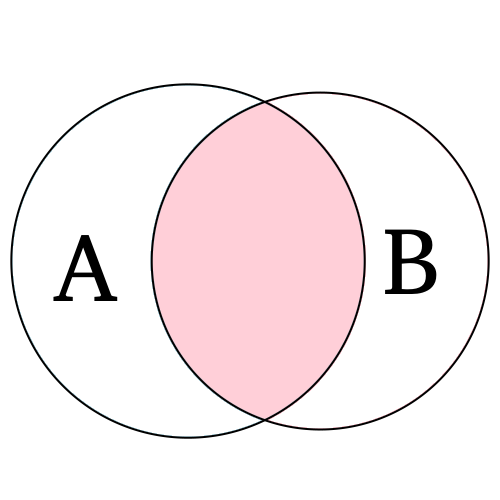
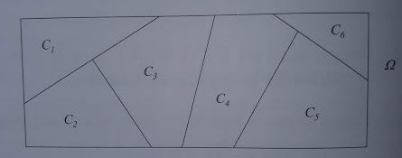

---
output:
  html_document:                    # Classe de documento.
    toc: true                       # Exibir sum?rio.
    toc_depth: 2                    # Profundidade do sum?rio.
    toc_float:                      # Sum?rio flutuante na borda.
      collapsed: true
      smooth_scroll: true
    number_sections: true           # Se??es numeradas.
    theme: flatly
    #default,cerulean,journal,flatly,readable,spacelab,
    #united,cosmo,lumen,paper,sandstone,simplex,yeti
    
    highlight: espresso
    #default, tango, pygments, kate, monochrome, espresso, zenburn, haddock, and textmate
    #css: styles.css                 # Caminho para arquivo CSS.
    fig_width: 7                    # Lagura das figuras.
    fig_height: 6                   # Altura das figuras.
    fig_caption: true               # Exibica??o de legenda.
    fig_align: 'center'
#    code_folding: hide              # Esconder/exibir bloco de c?digo.
#    keep_md: true                   # Manter o arquivo md.
    #template: quarterly_report.html # Caminho para o template.  
---

```{r setup, include=FALSE}
knitr::opts_chunk$set(echo = TRUE, cache = TRUE)
```

---

<font size="5"> 
<p align=”center”> <b> Parte 3 - Probabilidades </b> </center>
</font>

---

# **Probabilidades**

A teoria das probabilidades é o ramo da matemática que desenvolve e avalia modelos para descrever fenômenos aleatórios. É a base teórica para o desenvolvimento das técnicas estatísticas. 

Consiste em descrever o conjunto de resultados possíveis do fenômeno e atribuir pesos a cada possível resultado, refletindo suas chances de ocorrência, estes pesos são as chamadas probabilidades. 

---

# **Fenômenos determinísticos e aleatórios**

Os fenômenos podem ser classificados como determinísticos e aleatórios dependendo de como ocorre seu desfecho em diversas tentativas.

 - **Fenômenos determinísticos**: algo que, quando repetido diversas vezes, tem sempre o mesmo desfecho, isto é, o mesmo resultado. 

 - **Fenômenos aleatórios**: algo que, quando repetido diversas vezes, pode ter diferentes desfechos. É tratado como aleatório pois antes da execução não há como saber qual dos possíveis resultados será observado. Portanto, um fenômeno aleatório é uma situação ou acontecimento cujos resultados não podem ser previstos com certeza.

---

# **Teoria dos Conjuntos**

**Eventos** são resultados ou um subconjunto de resultados de um experimento aleatório, usualmente são representados por letras latinas maiúsculas (A, B, C, ...). A teoria dos conjuntos é utilizada para definir operações com eventos. Alguns conceitos importantes são:

 - **Espaço amostral**: conjunto de todos os resultados possíveis de um fenômeno aleatório. Denotado por $\Omega$. Os subconjuntos de $\Omega$ são os eventos. O espaço amostral pode ser:
    * **Discreto**: contêm apenas um número finito ou contável de elementos.
    * **Contínuo**: contêm um número infinito de elementos.

$\\$
    
 - **Conjunto vazio**: conjunto sem elementos, denotado por $\phi$.

 - **União**: sejam dois eventos $A$ e $B$, a união é denotada por $A ∪ B$ e representa a ocorrência de, pelo menos, um dos eventos A ou B.
 
<center>
<div>
  
</div>
</center>

 - **Interseção**: sejam dois eventos $A$ e $B$, a interseção é denotada por $A ∩ B$ e representa a ocorrência simultânea de A e B.

<center>
<div>
  
</div>
</center>

 - **Eventos disjuntos ou mutualmente exclusivos**: sejam dois eventos $A$ e $B$, eles são ditos disjuntos se possuem interseção nula, isto é, não têm elementos em comum. $A ∩ B =  \phi$.
 
<center>
<div>
  
</div>
</center>
 
 - **Eventos complementares**: eventos que a união resulta no espaço amostral e a intersecção é vazia. $A ∪ A^{c} =  \Omega$ e $A ∩ A^{c} =  \phi$.
 
<center>
<div>
  
</div>
</center>    
    
---

# **Definição axiomática de probabilidade**

Probabilidade é uma função $P(·)$ que atribui valores que mensuram a chance de ocorrência de eventos do espaço amostral, de tal forma que que atenda as condições:

 - $0 \leq  P(A) \leq 1, \forall A \in \Omega$

 - $P(\Omega) = 1$

 - $P \left ( ∪_{j=1}^{n} A_{j} \right ) = \sum_{j=1}^{n} P(A_{j})$, desde que os $A_{j}$ sejam disjuntos.

---

Considerando o que foi apresentado até o momento, o problema agora é: como atribuir probabilidades aos elementos do espaço amostral?

As principais maneiras de atribuir probabilidades são:

 - **A forma clássica**: baseia-se nas características teóricas da realização do fenômeno.

 - **A forma frequentista**: baseia-se nas frequências de ocorrência do fenômeno. Para um grande número de repetições, a frequência relativa dos eventos do espaço amostral são estimativas da verdadeira probabilidade. Intuitivamente é possível conjecturar que à medida que o número de repetições aumenta, as frequências relativas se estabilizam em um número que chamaremos de probabilidade. 

--- 

Considere dois experimentos: o lançamento de um dado e o lançamento de uma moeda. Considerando que sejam honestos, imaginamos que a probabilidade de uma face qualquer do dado aparecer em um lancamento seja 1/6 (considerando que são 6 faces e todas tem a mesma chance de ocorrência já que o dado é equilibrado). O mesmo para a moeda: considerando que são duas faces, a probabilidade de observar qualquer uma delas é igual a 1/2. Estas suposições são resultantes da atribuição de probabilidades pela forma clássica.

Pela forma frequentista deveríamos repetir o experimento de lançar o dado e a moeda um grande número de vezes já que a Lei dos Grandes Números nos diz que as estimativas das probabilidades dadas pelas frequências relativas tendem a ficar melhores com mais observações. 

Os gráficos a seguir apresentam o resultado da simulação de diversos lançamentos de um dado e uma moeda, note que quanto maior o número de lançamentos mais próxima a probabilidade obtida fica daquela obtida pela forma clássica:
 
```{r, echo=FALSE, results='hide', fig.width=10}
dado <- function(n){
  x <- vector()
  for(i in 1:n){
    a <- sample(1:6,1)
    x[i] <- a
    t <- table(x)
    }
  print(t/n)
  }

moeda <- function(n){
  x <- vector()
  for(i in 1:n){
    a <- sample(1:2,1)
    x[i] <- a
    t <- table(x)
    }
  names(t) <- c("Cara", "Coroa")
  print(t/n)
  }

par(mfrow = c(2,4), par(oma=c(0,3,3,0)))

plot(dado(10),     ylim = c(0,0.3), main = "", ylab = "Prob.", xlab = "")
abline(h = 1/6, col = 2, lwd = 2, lty = 2)
mtext("Dado", side=2, line=5, cex=1.5 )
mtext("10 lançamentos", side=3, line=3, cex=1 )

plot(dado(100),    ylim = c(0,0.3), main = "", ylab = "Prob.", xlab = "")
abline(h = 1/6, col = 2, lwd = 2, lty = 2)
mtext("100 lançamentos", side=3, line=3, cex=1 )

plot(dado(1000),   ylim = c(0,0.3), main = "", ylab = "Prob.", xlab = "")
abline(h = 1/6, col = 2, lwd = 2, lty = 2)
mtext("1000 lançamentos", side=3, line=3, cex=1 )

plot(dado(10000),  ylim = c(0,0.3), main = "", ylab = "Prob.", xlab = "")
abline(h = 1/6, col = 2, lwd = 2, lty = 2)
mtext("10000 lançamentos", side=3, line=3, cex=1 )

plot(moeda(10),     ylim = c(0,0.7), main = "", ylab = "Prob.", xlab = "Face")
abline(h = 1/2, col = 2, lwd = 2, lty = 2)
mtext("Moeda", side=2, line=5, cex=1.5 )

plot(moeda(100),    ylim = c(0,0.7), main = "", ylab = "Prob.", xlab = "Face")
abline(h = 1/2, col = 2, lwd = 2, lty = 2)

plot(moeda(1000),   ylim = c(0,0.7), main = "", ylab = "Prob.", xlab = "Face")
abline(h = 1/2, col = 2, lwd = 2, lty = 2)

plot(moeda(10000),  ylim = c(0,0.7), main = "", ylab = "Prob.", xlab = "Face")
abline(h = 1/2, col = 2, lwd = 2, lty = 2)

```
 
---

## **Adição de probabilidades**

A probabilidade da união de eventos é calculada através da regra da adição de probabilidades:

$$P(A ∪ B) =  P(A) + P(B) − P(A ∩ B)$$


Se A e B forem disjuntos, a expressão se reduz à soma das probabilidades.

```{r,echo=FALSE}
#Sabendo que 52% dos alunos está na turma A, 48% na turma B. Escolhendo um aluno ao acaso, qual a probabilidade de escolhermos um aluno do sexo feminino E da turma B?

#$$P(F)=0,74, \ P(M)=0,26, \\ P(A) = 0,52, \ P(B) = 0,48, \\ P(F ∩ B) = 0,32$$

#$$P(F ∪ B) =  P(F) + P(B) − P(F ∩ B) \\ P(F ∪ B) =  0,74 + 0,48 − 0,32 = 0,9$$
```

Como consequência da regra da adição, obtemos que, para qualquer evento $A \subset \Omega$:

$$P(A) =  1 - P(A^{c})$$

Consequentemente:

$$P(A ∪ A^{c}) =  P(\Omega) = 1$$

---

## **Probabilidade condidional**

Em muitas situações, o fenômeno de interesse pode ser separado em etapas. A informação do que ocorreu em uma etapa pode influenciar nas etapas seguintes. Nestas situações há um ganho de informação e pode-se recalcular as probabilidades. Estas probabilidades são as chamadas probabilidades condicionais. Dados dois eventos A e B, a probabilidade condicional de A ocorrer, dado que ocorreu B é representado por P(A|B).

 - Quando $P(B) > 0$:

$$P(A|B) = \frac{P(A ∩ B)}{P(B)}$$

 - Quando $P(B) = 0$:

$$P(A|B) = P(A)$$

---

## **Regra do produto**

Da definição de probabilidade condicional, é possível deduzir a regra do prodto:

$$P({A ∩ B}) = P(A|B)P(B),$$ com $P(B)>0$.

---

## **Independência de eventos**

Dois eventos A e B são independentes se a informação da ocorrência de um não altera a probabilidade de ocorrência do outro:

$$P(A|B) = P(A), P(B) > 0$$
ou, de forma equivalente:

$$P({A ∩ B}) = P(A)P(B)$$

---

## **Partição do espaço amostral**

Os eventos $C_1, C_2, ..., C_k$ formam uma partição do espaço amostral se eles não tem interseção entre si e sua união é igual ao espaço amostral. Isto é:

 - $C_i ∩ C_j = \phi$, para $i \neq j$
 
 - $∪_{i=1}^{k} C_{i} = \Omega$

<center>

</center>

---

## **Teorema de Bayes**

Suponha que os eventos $C_1, C_2, ..., C_k$ formem uma partição de $\Omega$ e que suas probabilidades sejam conhecidas.Suponha ainda que, para um evento A, se conheçam as probabilidades $P(A|C_i)$  para todo $i = 1,2,...,k$. Entãom para qualquer $j$ temos que:

$$P(C_j|A) = \frac{P(A|C_j)P(C_j)}{\sum_{i=1}^{k}P(A|C_i)P(C_i)},\ j=1,2,...,k$$

---

Críticas e sugestões a este material sempre serão bem vindas.

Para entrar em contato comigo, envie uma mensagem para <lineuacf@gmail.com>.

---


<div class="tocify-extend-page" data-unique="tocify-extend-page" style="height: 0;"></div>